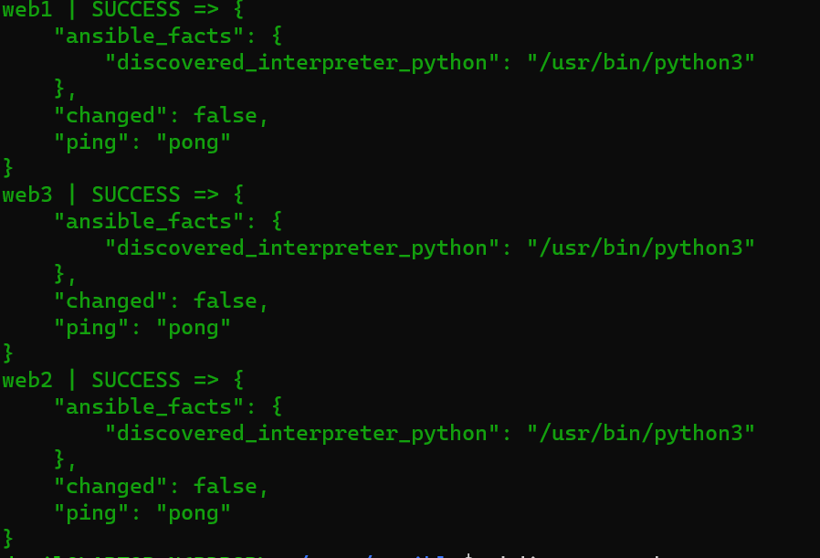

# testing_ansible
1) Простое поднятие 3 контейнеров
```sh
docker compose up -d
```
2) Проверка docker-compose и inventory
```sh
ansible all -i inventory -m ping
ansible-inventory -i inventory --list
```

3) Воруем minio и запускаем spark, minio
```sh
 ansible-galaxy install -p . andrewrothstein.minio
 ansible-playbook -i inventory playbook.yml
 docker compose exec -d -u 0 web3 minio server ~/minio --quiet --console-address :9090
 ssh -L localhost:9090:localhost:9090 root@localhost -p 2224
```
1)spark -> role
2)Jenkins spark_master, worker, minio s3
3)Using python script
4)Pipeline write
	4.1) if script builded not correct just docker compose down
	4.2) ansible+jenkins